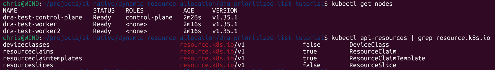
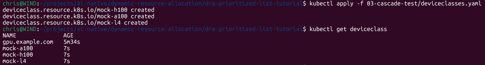
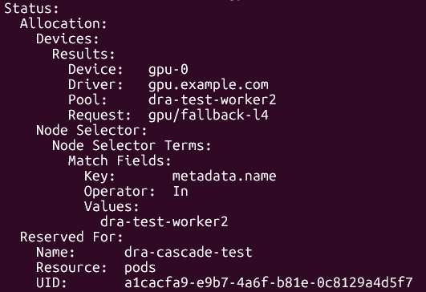

# DRA Hands-On: Walking the Prioritized List Cascade on Kubernetes 1.36

> Tested on Kind + kubernetes-sigs/dra-example-driver: mock GPUs, $0 cost

---

## What you'll learn

By the end of this tutorial, you will:

- Have a local Kubernetes 1.36 cluster running DRA with the example driver
- Understand how to declare hardware preferences using `firstAvailable` (Prioritized List)
- See the scheduler walk down a cascade of device preferences (mock H100 → A100 → L4)
- Know how to translate these allocation patterns to production with NVIDIA's DRA driver

⚠️ *Scope note: this tutorial focuses on the allocation primitive. Training patterns (PyTorch DDP), inference serving (KServe) and gang scheduling (Kueue) are separate concerns we'll explore in follow-up articles of this series.*

---

## Context

In March 2026 at KubeCon Europe, NVIDIA donated their DRA driver to the CNCF: a clear signal that **Dynamic Resource Allocation** is becoming the substrate for **AI workloads on Kubernetes**.

DRA went GA in  K8s v1.34. 

In v1.36 "Haru", multiple DRA features flip to Beta-by-default, including **Prioritized List**: the pattern that lets you declare:

> *"Give me an H100. Fall back to A100. Then to L4."*

This is the moment hardware heterogeneity becomes declarative.

To explore these patterns without needing physical GPUs, this tutorial uses the example driver from `kubernetes-sigs/dra-example-driver`, which simulates GPUs.

The allocation semantics, how Kubernetes schedules and matches devices, are identical to what you'd see with NVIDIA's driver in production.

> ⚠️ **Note**: this tutorial uses simulated GPUs via the example driver. The pod scheduling and allocation are real, but no actual GPU workload runs. For real CUDA/PyTorch execution, you need physical NVIDIA GPUs and the NVIDIA DRA driver.

---

## Why DRA matters: the CNCF AI Conformance connection

DRA is a **core requirement** of the CNCF Kubernetes AI Conformance Program, launched in November 2025 at KubeCon NA. The program defines a baseline of capabilities that a Kubernetes cluster must offer to reliably run AI/ML workloads and it lists DRA as a mandatory primitive:

> *"Platforms must support Dynamic Resource Allocation (DRA) APIs to enable more flexible and fine-grained resource requests beyond simple counts."*
> — [CNCF AI Conformance Requirements v1.35](https://github.com/cncf/k8s-ai-conformance)

That's why DRA isn't just one feature among many in v1.36: it's the **primitive that made the program possible**. The number of certified platforms nearly doubled between November 2025 and March 2026.

**Important clarification on tooling**: this tutorial uses the [`kubernetes-sigs/dra-example-driver`](https://github.com/kubernetes-sigs/dra-example-driver), maintained by the **Kubernetes SIG Node** as a reference implementation.

It is **not** part of the CNCF AI Conformance test suite: those are two distinct projects. The example driver is the easiest way to explore DRA's allocation patterns locally; the AI Conformance suite validates whether a full Kubernetes platform meets the broader AI workload requirements.

For more context on the program itself, see my deep-dive: [Kubernetes AI Conformance: What You Need to Know](https://www.linkedin.com/pulse/kubernetes-ai-conformance-what-you-need-know-christian-dussol-nr4ge).

---

## Prerequisites

- Docker Desktop (4.37.1+) running
- `kind` v0.31.0 or later
- `kubectl` v1.36+ recommended (skew of ±1 minor version supported)
- `helm` v3.x
- About 4 GB of free RAM for the cluster
- Around 30 minutes

⚠️ **Compatibility note**: at the time of writing, the official `kindest/node:v1.36.x` image may not yet be published. The latest stable image was `v1.35.1`. If v1.36 isn't available yet, the tutorial works on v1.35 with the `DRAPrioritizedList` feature gate enabled (Alpha in v1.35). The manifests remain identical.

📝 *Verify before starting: check https://github.com/kubernetes-sigs/kind/releases for the latest image tag.*

---

## Repository structure

```
dra-prioritized-list-tutorial/
├── README.md                              # This file
├── LICENSE                                # See parent repository root for license terms (CC BY-SA 4.0)
├── 01-cluster-setup/
│   └── kind-dra-config.yaml               # Multi-node Kind cluster with DRA enabled
├── 02-driver-install/
│   └── install-script.sh                  # Install the dra-example-driver
├── 03-cascade-test/
│   ├── deviceclasses.yaml                 # Three mock DeviceClasses (H100/A100/L4)
│   ├── resourceclaim-prioritized.yaml     # ResourceClaimTemplate with firstAvailable
│   └── test-pod.yaml                      # Pod that consumes the claim
├── 04-walk-the-cascade/
│   └── walk-script.sh                     # Progressively delete classes, observe fallback
├── setup/
│   ├── start-kind.sh                      # Create the Kind cluster
│   └── cleanup-kind.sh                    # Delete the Kind cluster
└── docs/
    ├── screenshots/                       # Captures from your test run
    └── logs/                              # Sample kubectl outputs
```

Each numbered folder corresponds to one step of the tutorial. Run them in order.

---

## Step 1: Create the Kind cluster

The cluster runs three nodes (1 control-plane + 2 workers) to better reflect a real allocation scenario.

Make the setup scripts executable, then use the helper script to install Kind if needed and create the cluster:

```bash
chmod +x setup/start-kind.sh setup/cleanup-kind.sh
./setup/start-kind.sh
```

This script installs `kind` if it is missing and then creates the cluster with the configured Kind node image.

⚠️ *Replace `v1.35.1` with `v1.36.x` once available.*

Verify the cluster is up and DRA is enabled:

```bash
kubectl get nodes
kubectl api-resources | grep resource.k8s.io
```



You should see `deviceclasses`, `resourceclaims`, and `resourceslices` listed. If not, DRA isn't enabled — check the feature gates in `01-cluster-setup/kind-dra-config.yaml`.

---

## Step 2: Install the example driver

The `dra-example-driver` simulates GPUs without requiring any hardware.

Make the install script executable, then run it:

```bash
chmod +x 02-driver-install/install-script.sh
./02-driver-install/install-script.sh
```

Verify the driver is running:

```bash
kubectl get pods -A | grep dra-example
kubectl get resourceslices -o yaml
```

You should see ResourceSlices being published by each worker node, each advertising simulated GPUs.

⚠️ *To verify during your test: exact pod namespace, presence of webhook (may require cert-manager), and the attribute names exposed by the driver (used in Step 3).*

---

## Step 3: Define the cascade

The example driver exposes a default DeviceClass. To demonstrate a meaningful Prioritized List cascade, we define **three custom DeviceClasses** that filter the same underlying mock GPUs based on different selector criteria, simulating H100/A100/L4 tiers.

```bash
kubectl apply -f 03-cascade-test/deviceclasses.yaml
kubectl get deviceclass
```



You should see three DeviceClasses: `mock-h100`, `mock-a100`, `mock-l4`.

Then apply the ResourceClaimTemplate and the pod that uses it.

The template defines how the claim should be generated, but the actual `ResourceClaim` is created when the pod is instantiated and references that template.

```bash
kubectl apply -f 03-cascade-test/resourceclaim-prioritized.yaml
kubectl apply -f 03-cascade-test/test-pod.yaml
```

Watch the scheduler match the first available option:

```bash
kubectl describe pod dra-cascade-test
kubectl get resourceclaims
```

You should see:

- the pod `dra-cascade-test` in `Running` state
- a generated `ResourceClaim` in `allocated,reserved` state
- the claim name referenced in the pod spec under `resourceClaims`

Then inspect the claim details:

```bash
kubectl describe resourceclaim <generated-claim-name>
```

Expected allocation behavior:

- `firstAvailable` should list `mock-h100`, `mock-a100`, and `mock-l4`
- the scheduler should select the first matching subrequest, typically `gpu/prefer-h100` if H100 is available
- the claim should show an allocated device result such as `gpu-0` on one of the worker nodes

⚠️ *To verify: the actual CEL selector syntax matching the driver's attributes. Adjust `03-cascade-test/deviceclasses.yaml` if the driver advertises differently.*

---

## Step 4: Walk the cascade

Now the interesting part: progressively make the top-tier DeviceClasses unavailable and watch the scheduler descend the cascade.

Make the walker script executable, then run it:

```bash
chmod +x 04-walk-the-cascade/walk-script.sh
./04-walk-the-cascade/walk-script.sh
```

The script will:
1. Delete the pod and ResourceClaim
2. Make `mock-h100` unavailable — the scheduler should now pick `mock-a100`
3. Re-create the pod, verify allocation on `mock-a100`
4. Make `mock-a100` unavailable — the scheduler should descend to `mock-l4`
5. Re-create the pod, verify allocation on `mock-l4`

This demonstrates the core promise of Prioritized List: declarative heterogeneity-aware allocation.

> Note: deleting a DeviceClass object itself is not the right way to test prioritized fallback.
> The scheduler expects the referenced DeviceClass to remain present; fallback is triggered when the class exists but no matching device is available.

### Verify the final fallback landed on `mock-l4`

1. Note the generated claim name:

```bash
kubectl get resourceclaim
```

2. Inspect the associated claim:

```bash
kubectl describe resourceclaim <generated-claim-name>
```

3. Look for the selected branch in the output:

- the claim should be in `allocated,reserved`
- the `Request:` section should show `deviceClassName: mock-l4`
- or the YAML output should contain `mock-l4` in the allocated request block

If the claim is allocated and `mock-h100` / `mock-a100` are disabled, then `mock-l4` is the final fallback used.



⚠️ *Expected behavior to verify: pod fallback should be automatic. If the pod stays Pending instead, adjust the script and document the gap.*

---

## Troubleshooting

**Symptom:** `kubectl get deviceclass` returns no resources
- DRA isn't enabled. Verify the feature gates in `01-cluster-setup/kind-dra-config.yaml`
- Check `kubectl api-resources | grep resource.k8s.io` returns at least 3 resources

**Symptom:** Pod stays Pending forever
- Run `kubectl describe pod dra-cascade-test` and look at the Events section
- Verify the driver is running: `kubectl get pods -A | grep dra-example`
- Check ResourceSlices: `kubectl get resourceslices -o yaml`
- A common cause: CEL selectors don't match what the driver advertises

**Symptom:** Driver installation fails
- Check Docker Desktop memory limits (need at least 4 GB)
- The driver may require cert-manager for its webhook. Install it first if needed:
  ```bash
  kubectl apply -f https://github.com/cert-manager/cert-manager/releases/latest/download/cert-manager.yaml
  ```

**Symptom:** "no devices available" even though DeviceClasses exist
- The CEL selectors might not match what the driver advertises
- Inspect what the driver publishes: `kubectl get resourceslices -o yaml`
- Adjust the CEL expression in `03-cascade-test/deviceclasses.yaml`

⚠️ *More troubleshooting entries to be added after the test run.*

---

## From tutorial to production

In production, you'd swap the example driver for **NVIDIA's k8s-dra-driver** (now a CNCF project) or another vendor driver. The DeviceClass and ResourceClaim manifests shown here remain identical, that's the point of a standard primitive.

What changes in production:
- The driver talks to real hardware (NVIDIA GPUs, AMD, Intel accelerators)
- You get features like MIG partitioning, time-slicing, NVLink topology awareness
- DeviceClass selectors filter on real attributes (compute capability, memory, topology)

The cascade pattern stays exactly the same.

---

## What's next: from allocation to AI workloads

What we covered today is the foundation: **allocation**. What sits on top: training jobs, inference servers, gang scheduling uses these primitives but adds its own concerns.

What I'm exploring next in this series:

- **Gang scheduling** with DRA + Kueue: coordinated allocation for batch AI workloads
- **Training patterns** with DRA + PyTorch DDP: distributed workloads on top of the allocation primitive
- **Inference serving** with DRA + KServe: model serving that leverages declarative hardware

Beyond this tutorial, DRA itself continues to evolve. The Kubernetes SIG Node frames v1.36 as ["the next era of DRA"](https://kubernetes.io/blog/2026/05/07/kubernetes-v1-36-dra-136-updates/), highlighting three trajectories worth tracking:

- **PodGroup ResourceClaims**: shared resources across coordinated Pods, opening the door to dynamic workloads that join a group without prior knowledge of the claim
- **Native resources**: DRA extending beyond accelerators to memory and CPU, making the primitive truly universal
- **Driver ecosystem expansion**: support for networking and other hardware types, beyond compute accelerators

Each of these deserves its own exploration. If this allocation pattern made sense, you're ready for the next layers once they're written.

---

## Cleanup

When you're done:

```bash
chmod +x setup/cleanup-kind.sh
./setup/cleanup-kind.sh
```

This removes the Kind cluster and all resources created for the tutorial.

If you prefer the direct command, you can also run:

```bash
kind delete cluster --name dra-test
```

---

## References

- [Kubernetes v1.36 release blog](https://kubernetes.io/blog/2026/04/22/kubernetes-v1-36-release/)
- [Kubernetes v1.36: More Drivers, New Features, and the Next Era of DRA](https://kubernetes.io/blog/2026/05/07/kubernetes-v1-36-dra-136-updates/): SIG Node deep-dive on DRA in 1.36 (7 May 2026)
- [Kubernetes DRA documentation](https://kubernetes.io/docs/concepts/scheduling-eviction/dynamic-resource-allocation/)
- [Install Drivers and Allocate Devices with DRA (official tutorial)](https://kubernetes.io/docs/tutorials/cluster-management/install-use-dra/)
- [kubernetes-sigs/dra-example-driver](https://github.com/kubernetes-sigs/dra-example-driver)
- [Kubernetes AI Conformance: What You Need to Know](https://www.linkedin.com/pulse/kubernetes-ai-conformance-what-you-need-know-christian-dussol-nr4ge) (LinkedIn Pulse, Nov 2025)
- [KEP-4816: DRA Prioritized List](https://github.com/kubernetes/enhancements/tree/master/keps/sig-node/4816-dra-prioritized-list)

---

## Acknowledgments

This tutorial stands on the shoulders of **Kubernetes SIG Node**, which maintains the `dra-example-driver` and the broader DRA subsystem.

SIG Node is the home of the Dynamic Resource Allocation work from the original KEP-3063 in 2022, through Alpha, Beta, GA in v1.34, and the Beta-by-default features that landed in v1.36 "Haru". None of what this repository demonstrates would be possible without their sustained, multi-year effort.

If you find this tutorial useful, consider engaging with SIG Node directly:

- **Weekly meetings**: Tuesdays 10:00 PT
- **Slack**: `#sig-node` on [slack.k8s.io](https://slack.k8s.io)
- **Mailing list**: kubernetes-sig-node@googlegroups.com
- **GitHub**: [kubernetes/community/sig-node](https://github.com/kubernetes/community/tree/master/sig-node)
- **Example driver**: [kubernetes-sigs/dra-example-driver](https://github.com/kubernetes-sigs/dra-example-driver)

Quiet work. Foundational.

---

## License

This tutorial is published under the Creative Commons Attribution-ShareAlike 4.0 International License.
See the repository root [LICENSE](../LICENSE) file for full terms.

---

*Maintained by Christian Dussol
